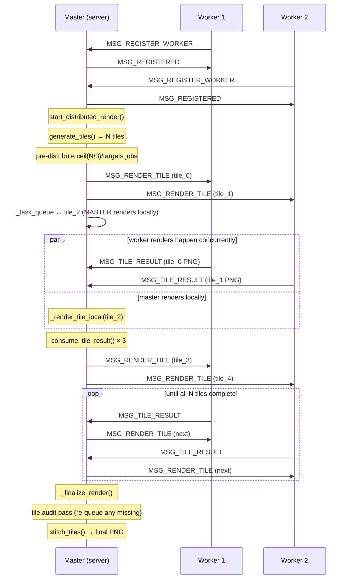
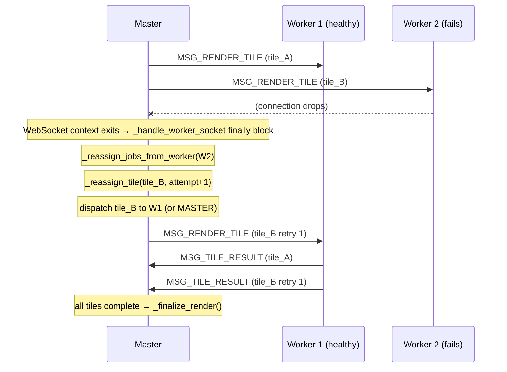
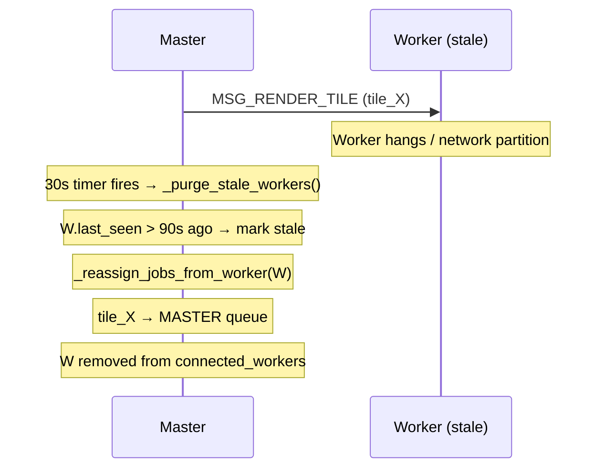
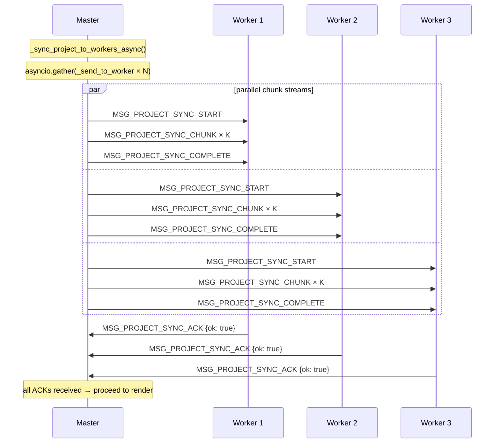
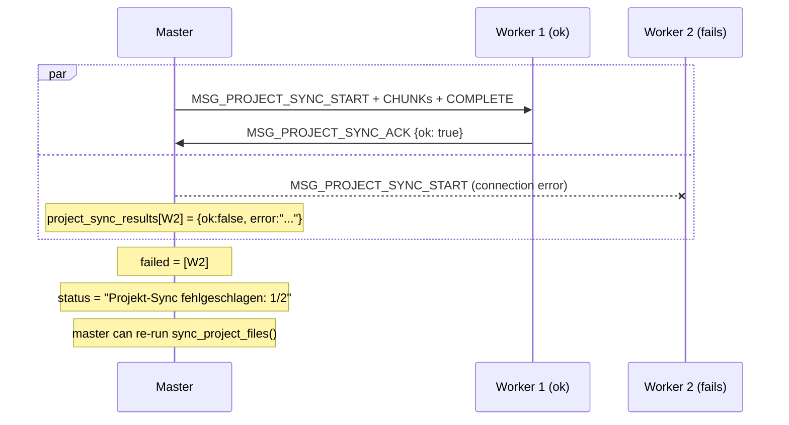
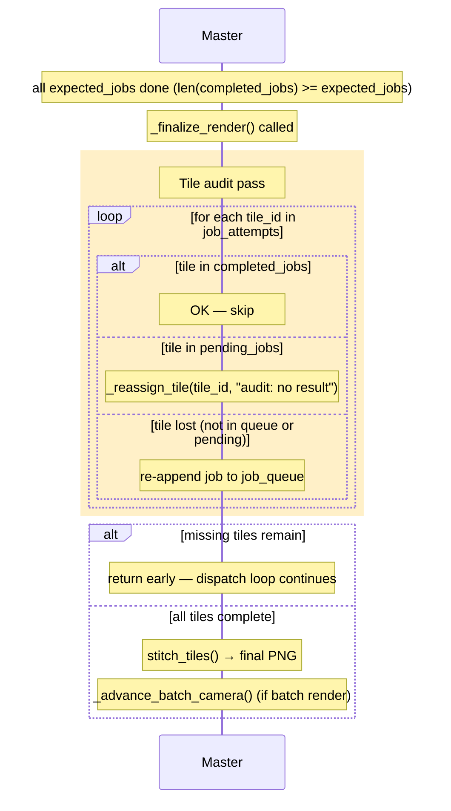
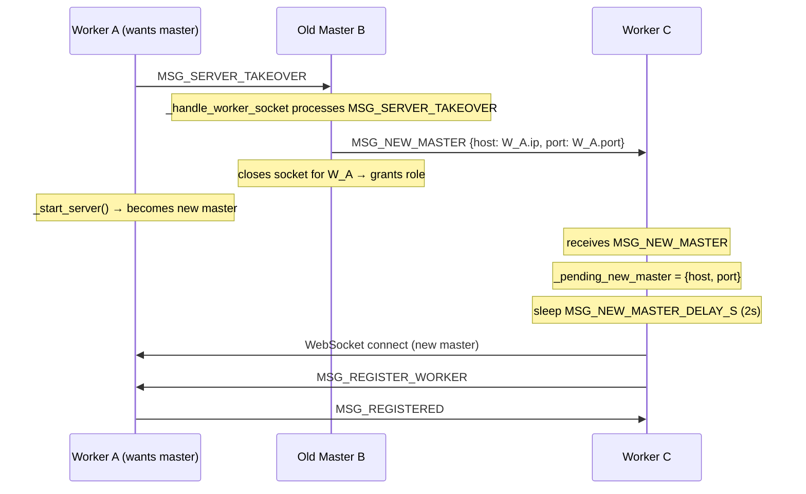
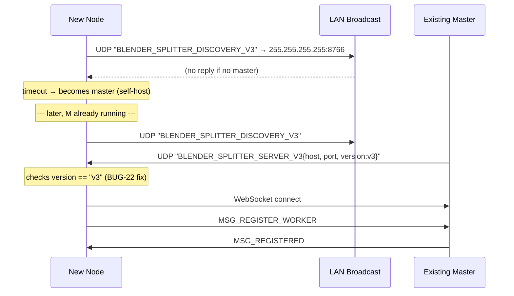
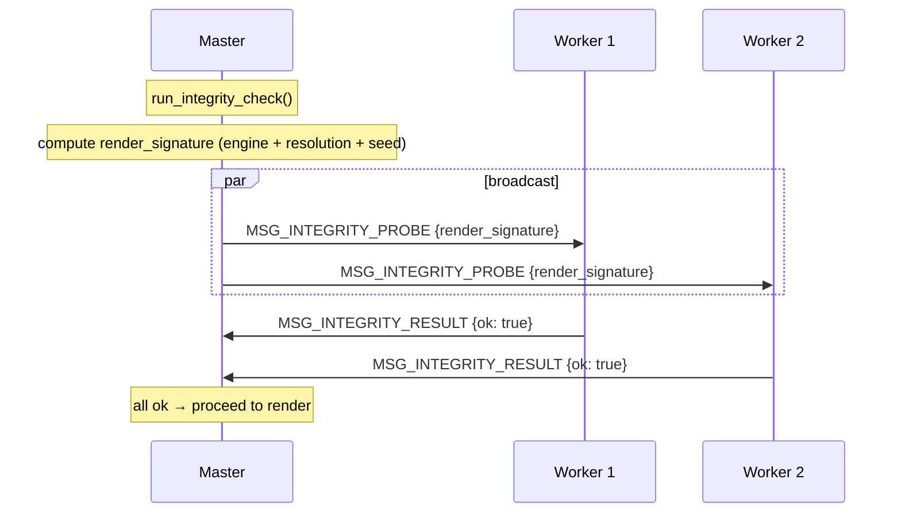

# BlenderSplitter — Protocol Sequence Diagrams

_Last updated: 2026-04-06_

All diagrams use [Mermaid](https://mermaid.js.org/) syntax and render directly
in GitHub.

---

## 1  Normal Job Distribution

Covers the full lifecycle of a single distributed render: workers connect,
master starts a render, tiles are distributed, results are collected, and the
final image is stitched.

---

## 2  Worker Failure and Tile Reassignment

Shows what happens when a worker disconnects mid-render (connection drop,
crash, or stale-worker expiry).

### Stale-Worker Expiry (BUG-18 fix)

Workers send `MSG_HEARTBEAT` every 30 s.  The master's timer callback runs
`_purge_stale_workers()` every 30 s.  Any worker whose `last_seen` is more than
90 s old is treated as disconnected and its pending tiles are reassigned.

---

## 3  Project Sync / Parallel Download

The master sends the `.blend` bundle to **all workers simultaneously** using
`asyncio.gather`.  Previously this was sequential — total transfer time was
O(n·size).  After the fix it is O(1·size) (bounded by the slowest link).

### Sync Failure Handling

If a worker's connection drops mid-transfer or the ACK times out, its result
is marked `ok: false` and the sync is reported as partially failed.  The
master can retry (by calling `sync_project_files()` again) or abort.

---

## 4  Render Finalization and Tile Audit

Before stitching, `_finalize_render` runs a **tile audit pass** to detect tiles
that were claimed by a now-dead worker but never completed.  Those tiles are
re-queued and the dispatch loop continues until all are resolved.

---

## 5  Force Server / Master Takeover

A worker can request to take over the server role.  The old master broadcasts
the new master's address to all remaining workers before handing off.

---

## 6  UDP Discovery

---

## 7  Integrity Check

Before starting a distributed render the master verifies that all workers have
the same render configuration (engine, resolution, seed).

